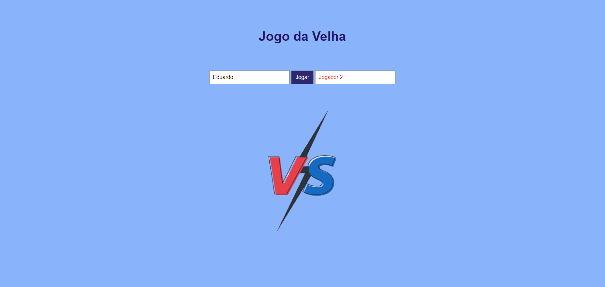
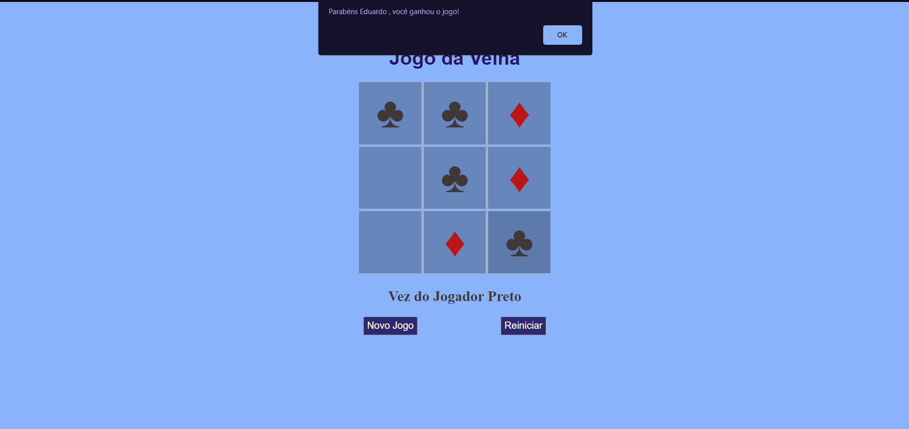

<h1 align="center" >Jogo da Velha</h1>

Projeto consiste em um jogo da velha em que é inserido os nomes dos jogadores antes de começar o jogo e, durante o jogo, os jogadores tem a opção de reiniciar ou iniciar um novo jogo com outros Players.
 

O projeto foi desenvolvido com a finalidade de reforçar os conhecimentos básicos de <strong>HTML, CSS e Javascript</strong>.

É um site <strong>responsivo</strong> para diferentes tipos de dispositivos.

 

## Execução do projeto:
Para rodar o projeto é necessário clonar o repositório e abrir o arquivo index.html no navegador.

## Link para visualização:
Se preferir, é possível visualizar pelo link: https://edusorrentino10.github.io/Jogo-da-Velha/

<h2 align="center"></h2>
<h2 align="center"></h2>

Feito por <a href="https://github.com/Edusorrentino10">Eduardo Sorrentino</a>.

Linkedin: https://linkedin.com/in/eduardo-sorrentino/